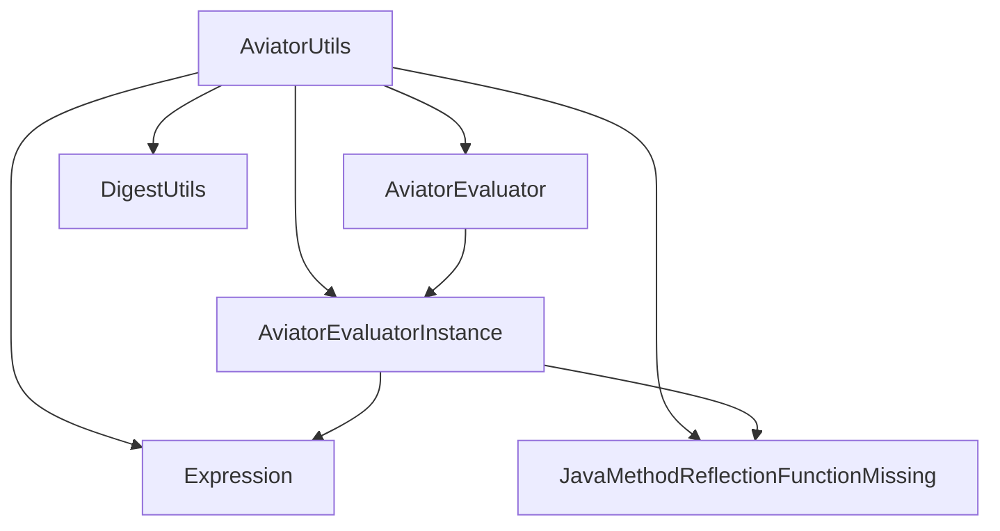

# 类参考：AviatorUtils

> 本文档提供 pms-rules 模块中 `AviatorUtils` 工具类的完整方法签名、字段定义和依赖关系。

---

## 1. 类定义

### 1.1 基本信息

| 项目 | 内容 |
|------|------|
| **全限定名** | `com.dp.plat.rules.util.AviatorUtils` |
| **源码路径** | `pms-rules/src/main/java/com/dp/plat/rules/util/AviatorUtils.java` |
| **文件行数** | 66 行 |
| **类修饰符** | `public class` |
| **继承** | `java.lang.Object`（隐式） |
| **实现接口** | 无 |
| **注解** | 无 |

### 1.2 类声明

```java
package com.dp.plat.rules.util;

import java.util.Map;
import org.springframework.util.DigestUtils;
import com.googlecode.aviator.AviatorEvaluator;
import com.googlecode.aviator.AviatorEvaluatorInstance;
import com.googlecode.aviator.Expression;
import com.googlecode.aviator.runtime.JavaMethodReflectionFunctionMissing;

public class AviatorUtils {
    // ...
}
```

---

## 2. 字段定义

### 2.1 静态字段

| 字段名 | 类型 | 修饰符 | 默认值 | 说明 |
|--------|------|--------|--------|------|
| `cacheSize` | `int` | `private static` | `100` | 表达式缓存容量 |

```java
private static int cacheSize = 100;
```

> ⚠️ 非 `volatile`，跨线程可见性不保证。

### 2.2 内部类

#### StaticHolder

| 项目 | 内容 |
|------|------|
| **修饰符** | `private static class` |
| **职责** | 持有 AviatorEvaluatorInstance 单例 |

| 字段名 | 类型 | 修饰符 | 说明 |
|--------|------|--------|------|
| `INSTANCE` | `AviatorEvaluatorInstance` | `private static` | Aviator 求值器单例 |

| 方法名 | 签名 | 修饰符 | 说明 |
|--------|------|--------|------|
| `newInstance` | `private static AviatorEvaluatorInstance newInstance()` | `private static` | 创建并配置新的求值器实例 |

```java
private static class StaticHolder {
    private static AviatorEvaluatorInstance INSTANCE = newInstance();
    
    private static AviatorEvaluatorInstance newInstance() {
        AviatorEvaluatorInstance instance = AviatorEvaluator.getInstance();
        instance.useLRUExpressionCache(cacheSize);
        instance.setCachedExpressionByDefault(true);
        instance.setFunctionMissing(JavaMethodReflectionFunctionMissing.getInstance());
        return instance;
    }
}
```

---

## 3. 方法签名

### 3.1 公共方法

#### `getInstance()`

```java
public static AviatorEvaluatorInstance getInstance()
```

| 项目 | 内容 |
|------|------|
| **返回值** | `AviatorEvaluatorInstance` — Aviator 求值器单例 |
| **异常** | 无 |
| **线程安全** | 是（JVM 保证静态内部类初始化） |
| **调用点** | `WorkflowUtil.java:114`、内部方法 |

---

#### `exceute(String, Map)`

```java
public static Object exceute(String script, Map<String, Object> env)
```

| 项目 | 内容 |
|------|------|
| **参数 `script`** | `String` — Aviator 表达式字符串 |
| **参数 `env`** | `Map<String, Object>` — 变量环境 |
| **返回值** | `Object` — 表达式计算结果 |
| **异常** | `ExpressionSyntaxErrorException`、`CompileExpressionErrorException`、`RuntimeException` |
| **线程安全** | 是 |

> ⚠️ 方法名 `exceute` 为历史遗留拼写错误（应为 `execute`）。

---

#### `getCacheSize()`

```java
public static int getCacheSize()
```

| 项目 | 内容 |
|------|------|
| **返回值** | `int` — 当前缓存容量 |
| **异常** | 无 |
| **线程安全** | 读取非 volatile 字段 |

---

#### `setCacheSize(int)`

```java
public static void setCacheSize(int cacheSize)
```

| 项目 | 内容 |
|------|------|
| **参数 `cacheSize`** | `int` — 缓存容量 |
| **返回值** | 无 |
| **异常** | 无 |
| **线程安全** | ⚠️ 不安全 |

---

#### `resetAviator()`

```java
public static void resetAviator()
```

| 项目 | 内容 |
|------|------|
| **返回值** | 无 |
| **异常** | 无 |
| **线程安全** | ⚠️ 不安全 |

---

### 3.2 方法签名汇总

```java
// 获取求值器实例
public static AviatorEvaluatorInstance getInstance()

// 执行表达式
public static Object exceute(String script, Map<String, Object> env)

// 缓存管理
public static int getCacheSize()
public static void setCacheSize(int cacheSize)
public static void resetAviator()
```

---

## 4. 依赖关系

### 4.1 类依赖图



### 4.2 import 清单

| 类 | 包 | 来源 | 用途 |
|----|-----|------|------|
| `Map` | `java.util` | JDK | env 参数类型 |
| `DigestUtils` | `org.springframework.util` | spring-core | 生成 MD5 缓存 Key |
| `AviatorEvaluator` | `com.googlecode.aviator` | aviator | 获取全局实例 |
| `AviatorEvaluatorInstance` | `com.googlecode.aviator` | aviator | 求值器实例类型 |
| `Expression` | `com.googlecode.aviator` | aviator | 编译后的表达式 |
| `JavaMethodReflectionFunctionMissing` | `com.googlecode.aviator.runtime` | aviator | 函数缺失反射回调 |

### 4.3 Maven 依赖

```xml
<!-- 直接依赖 -->
<dependency>
    <groupId>com.googlecode.aviator</groupId>
    <artifactId>aviator</artifactId>
    <version>5.4.3</version>
</dependency>

<dependency>
    <groupId>org.springframework</groupId>
    <artifactId>spring-context</artifactId>
</dependency>
```

---

## 5. 三处版本差异对照

### 5.1 完整方法签名对照

| 方法 | pms-rules | core | PMS-struts |
|------|-----------|------|------------|
| `getInstance()` | `public static AviatorEvaluatorInstance getInstance()` | 一致 | 一致 |
| `exceute(String, Map)` | `public static Object exceute(String, Map<String, Object>)` | 一致 | 一致 |
| `getCacheSize()` | `public static int getCacheSize()` | 一致 | 一致 |
| `setCacheSize(int)` | `public static void setCacheSize(int)` | 一致 | 一致 |
| `resetAviator()` | `public static void resetAviator()` | 一致 | 一致 |

### 5.2 exceute 方法实现差异

**pms-rules 版本**：

```java
String cacheKey = DigestUtils.md5DigestAsHex(script.getBytes());
```

**core 版本**：

```java
String cacheKey = PasswordUtil.encryptMD5Password(script);
```

**PMS-struts 版本**：

```java
String cacheKey = Md5Util.getMD5(script.getBytes());
```

### 5.3 import 差异

| import | pms-rules | core | PMS-struts |
|--------|-----------|------|------------|
| `org.springframework.util.DigestUtils` | ✅ | ❌ | ❌ |
| `com.dp.plat.core.util.PasswordUtil` | ❌ | ✅ | ❌ |
| `com.dp.plat.util.Md5Util` | ❌ | ❌ | ✅ |

---

## 6. 调用方参考

### 6.1 调用方清单

| 调用方 | 模块 | import 的版本 | 调用方法 |
|--------|------|---------------|----------|
| `InvoiceUtil` | pms-ext-fp | `com.dp.plat.rules.util.AviatorUtils` | `exceute` |
| `ProjectStateUpdateAspect` | PMS-struts | `com.dp.plat.util.AviatorUtils` | `exceute` |
| `AutoStartPresalesProjectJob` | PMS-struts | `com.dp.plat.util.AviatorUtils` | `exceute` |
| `SubcontractUtil` | PMS-struts | `com.dp.plat.util.AviatorUtils` | `exceute` |
| `SubcontractInspectionListener` | PMS-struts | `com.dp.plat.util.AviatorUtils` | `exceute` |
| `WorkflowUtil` | PMS-struts | `com.dp.plat.util.AviatorUtils` | `getInstance().compile` |
| `DispatchSettlementUpdateAspect` | PMS-springmvc | `com.dp.plat.util.AviatorUtils` | `exceute` |

### 6.2 测试代码调用

| 测试类 | 模块 | 调用方法 |
|--------|------|----------|
| `SubcontractTest` | PMS-struts (test) | `exceute` |
| `AutoStartPresalesProjectJobTest` | PMS-struts (test) | `exceute` |

---

## 7. 完整源码

```java
package com.dp.plat.rules.util;

import java.util.Map;

import org.springframework.util.DigestUtils;

import com.googlecode.aviator.AviatorEvaluator;
import com.googlecode.aviator.AviatorEvaluatorInstance;
import com.googlecode.aviator.Expression;
import com.googlecode.aviator.runtime.JavaMethodReflectionFunctionMissing;

public class AviatorUtils {

    private static int cacheSize = 100;

    private static class StaticHolder {
        private static AviatorEvaluatorInstance INSTANCE = newInstance();
        
        private static AviatorEvaluatorInstance newInstance() {
            AviatorEvaluatorInstance instance = AviatorEvaluator.getInstance();
            instance.useLRUExpressionCache(cacheSize);
            instance.setCachedExpressionByDefault(true);
            instance.setFunctionMissing(JavaMethodReflectionFunctionMissing.getInstance());
            return instance;
        }
    }

    public static AviatorEvaluatorInstance getInstance() {
        return StaticHolder.INSTANCE;
    }   

    public static Object exceute(String script, Map<String, Object> env) {
        // 启用基于反射的方法查找和调用
        AviatorEvaluatorInstance evaluatorInstance = getInstance();
        // 缓存的Key
        String cacheKey = DigestUtils.md5DigestAsHex(script.getBytes());
        // 编译脚本
        Expression expression = evaluatorInstance.compile(cacheKey, script, true);
        // 执行脚本
        Object result = expression.execute(env);
        return result;
    }

    public static int getCacheSize() {
        return cacheSize;
    }

    /**
     * 设置缓存长度
     * @param cacheSize
     */
    public static void setCacheSize(int cacheSize) {
        AviatorUtils.cacheSize = cacheSize;
        getInstance().useLRUExpressionCache(cacheSize);
    }
    
    /**
     * 重置resetAviator
     */
    public static void resetAviator() {
        // 清空原来示例的缓存释放内存
        getInstance().clearExpressionCache();
        // 生成一个新的实例，赋给单例对象
        StaticHolder.INSTANCE = StaticHolder.newInstance();
    }
}
```
