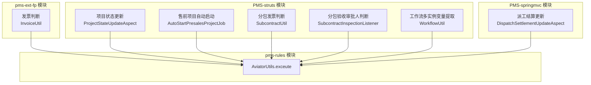
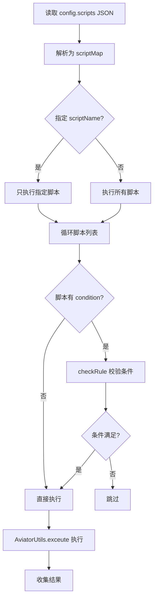
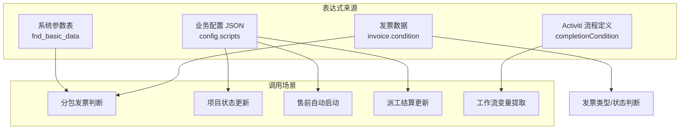

# 规则与业务集成

> 本文档梳理 PMS 系统中各业务模块使用 AviatorUtils 的调用点、表达式内容、变量环境和业务逻辑，共 7 个集成点。

---

## 1. 集成点总览



### 1.1 调用点汇总表

| 序号 | 模块 | 调用类 | 方法 | 业务场景 | 使用的 AviatorUtils 版本 |
|------|------|--------|------|----------|--------------------------|
| 1 | pms-ext-fp | `InvoiceUtil` | `checkFileInvoiceType` | 发票类型判断 | pms-rules 版本 |
| 2 | pms-ext-fp | `InvoiceUtil` | `checkFileInvoiceStatus` | 发票状态判断 | pms-rules 版本 |
| 3 | PMS-struts | `ProjectStateUpdateAspect` | `checkRule` | 项目状态更新条件校验 | PMS-struts 版本 |
| 4 | PMS-struts | `ProjectStateUpdateAspect` | `execScripts` | 项目状态更新脚本执行 | PMS-struts 版本 |
| 5 | PMS-struts | `AutoStartPresalesProjectJob` | `execScripts` | 售前项目自动启动脚本 | PMS-struts 版本 |
| 6 | PMS-struts | `SubcontractUtil` | `checkDeliveryInvoiceType` | 分包发票类型判断 | PMS-struts 版本 |
| 7 | PMS-struts | `SubcontractUtil` | `checkDeliveryInvoiceStatus` | 分包发票状态判断 | PMS-struts 版本 |
| 8 | PMS-struts | `SubcontractInspectionListener` | `checkAssignee` | 分包验收审批人条件判断 | PMS-struts 版本 |
| 9 | PMS-struts | `WorkflowUtil` | `callBackProcess` | 工作流多实例变量提取 | PMS-struts 版本 |
| 10 | PMS-springmvc | `DispatchSettlementUpdateAspect` | `checkRule` | 派工结算更新条件校验 | PMS-struts 版本 |
| 11 | PMS-springmvc | `DispatchSettlementUpdateAspect` | `execScripts` | 派工结算更新脚本执行 | PMS-struts 版本 |

> **说明**：共 7 个业务集成点（按业务场景归类），涉及 11 个代码调用点。测试代码中的调用（`SubcontractTest`、`AutoStartPresalesProjectJobTest`）未计入。

---

## 2. 集成点详解

### 2.1 发票判断（InvoiceUtil）

**模块**：pms-ext-fp
**文件**：`pms-ext-fp/src/main/java/com/dp/plat/pms/extend/fp/util/InvoiceUtil.java`

#### 2.1.1 checkFileInvoiceType — 发票类型判断

| 项目 | 内容 |
|------|------|
| **方法签名** | `public static boolean checkFileInvoiceType(Map<String, Object> invoice, Map<String, Object> config)` |
| **行号** | 117 |
| **业务场景** | 判断文件是否为发票类型，用于发票自动识别 |
| **表达式来源** | `config.invoiceTypeCondition` 或 `invoice.condition` |

**变量环境**：

| 变量名 | 类型 | 来源 | 说明 |
|--------|------|------|------|
| `entity` | `Map<String, Map>` | `Collections.singletonMap("entity", invoice)` | 嵌套结构，表达式需用 `entity.entity.xxx` 访问发票字段 |

**调用代码**：

```java
String condition = MapUtils.getString(config, "invoiceTypeCondition", condition);
Map<String, Object> env = new HashMap<String, Object>();
env.put("entity", Collections.singletonMap("entity", invoice));
return Boolean.TRUE.equals(AviatorUtils.exceute(condition, env));
```

**典型表达式示例**：

```
entity.entity.invoice_number != nil && entity.entity.amount > 0
```

**异常处理**：`try-catch(Exception)`，异常时回退到默认判断逻辑。

---

#### 2.1.2 checkFileInvoiceStatus — 发票状态判断

| 项目 | 内容 |
|------|------|
| **方法签名** | `public static boolean checkFileInvoiceStatus(Map<String, Object> invoice, Map<String, Object> config)` |
| **行号** | 147 |
| **业务场景** | 判断发票状态是否满足要求（已识别、已验证） |
| **表达式来源** | `config.invoiceStatusCondition` 或 `invoice.condition` |

**变量环境**：与 `checkFileInvoiceType` 一致。

**异常处理**：`try-catch(Exception)`，异常时回退到默认逻辑：

```java
return identify && (!needVerify || verified);
```

---

### 2.2 项目状态更新（ProjectStateUpdateAspect）

**模块**：PMS-struts
**文件**：`PMS-struts/src/com/dp/plat/maintenance/aop/ProjectStateUpdateAspect.java`

#### 2.2.1 checkRule — 状态更新条件校验

| 项目 | 内容 |
|------|------|
| **方法签名** | `public boolean checkRule(Map<String, Object> rule, Map<String, Object> variables)` |
| **行号** | 259 |
| **业务场景** | 检查项目状态更新规则是否满足启用条件 |
| **表达式来源** | `rule.condition` |

**变量环境**：

| 变量名 | 类型 | 来源 | 说明 |
|--------|------|------|------|
| `entity` | `Object` | `variables.get("entity")` | 业务实体（项目/维护记录等） |
| `config` | `Map` | `rule` | 规则配置 |
| `context` | `ProjectStateUpdateAspect` | `this` | 切面上下文，供表达式调用方法 |

**调用代码**：

```java
Map<String, Object> env = new HashMap<String, Object>();
env.put("entity", entity);
env.put("config", rule);
env.put("context", this);
result = AviatorUtils.exceute(condition, env);
```

**典型表达式示例**：

```
entity.projectState == 30 && config.enabled == true
```

**异常处理**：`try-catch(Exception)`，记录日志后返回 `false`。

---

#### 2.2.2 execScripts — 状态更新脚本执行

| 项目 | 内容 |
|------|------|
| **方法签名** | `public Object execScripts(Map<String, Object> entity, Map<String, Object> config, String scriptName)` |
| **行号** | 354 |
| **业务场景** | 执行项目状态更新时配置的脚本（如自动设置字段值） |
| **表达式来源** | `script.script`（JSON 配置中的 script 字段） |

**变量环境**：

| 变量名 | 类型 | 来源 | 说明 |
|--------|------|------|------|
| `entity` | `Map` | 业务实体集合 | 包含 project 等子实体 |
| `configs` | `Map` | `config` | 完整配置 |
| `context` | `ProjectStateUpdateAspect` | `this` | 切面上下文 |
| `config` | `Map` | 当前 `script` | 当前执行的脚本配置 |

**脚本执行流程**：



**异常处理**：`try-catch(Exception)`，收集错误信息，全部失败后抛出 `CustomRuntimeException`。

---

### 2.3 售前项目自动启动（AutoStartPresalesProjectJob）

**模块**：PMS-struts
**文件**：`PMS-struts/src/com/dp/plat/job/AutoStartPresalesProjectJob.java`

#### 2.3.1 execScripts — 售前项目启动脚本

| 项目 | 内容 |
|------|------|
| **方法签名** | `private Object execScripts(Map<String, Object> entity, Map<String, Object> config, String scriptName)` |
| **行号** | 248 |
| **业务场景** | 售前项目自动启动时执行配置的脚本（如自动设置项目类型） |
| **表达式来源** | `script.script` |

**变量环境**：

| 变量名 | 类型 | 来源 | 说明 |
|--------|------|------|------|
| `entity` | `Map` | 业务实体 | 包含 `presales` 子实体 |
| `config` | `Map` | 配置 | 完整配置 |
| `context` | `AutoStartPresalesProjectJob` | `this` | Job 上下文 |

**典型脚本示例**（从注释代码推断）：

```java
// 根据办事处和项目名称自动设置项目类型
if (presales.officeName == '战略合作部') {
    projectType = '战略合作';
} else if (presales.projectName == '集采') {
    projectType = '集采';
} else if (presales.projectName == '展会') {
    projectType = '展会';
} else {
    projectType = '销售测试';
}
setProjectType(presales, projectType);
```

> **注意**：上述脚本使用了 `setProjectType(presales, projectType)`，依赖 `JavaMethodReflectionFunctionMissing` 反射调用 `context` 对象的方法。

**异常处理**：`try-catch(Exception)`，`e.printStackTrace()`，结果数量不匹配时抛出异常。

---

### 2.4 分包验收（SubcontractUtil）

**模块**：PMS-struts
**文件**：`PMS-struts/src/com/dp/plat/subcontract/utils/SubcontractUtil.java`

#### 2.4.1 checkDeliveryInvoiceType — 分包发票类型判断

| 项目 | 内容 |
|------|------|
| **方法签名** | `public static boolean checkDeliveryInvoiceType(Map<String, Object> invoice)` |
| **行号** | 51 |
| **业务场景** | 判断分包交付件是否为发票类型 |
| **表达式来源** | 系统参数 `SUBCONTRACT_INSPECTION_DELIVERY_CHECK_INVOICE_CONDITION` 或 `invoice.condition` |

**变量环境**：与 `InvoiceUtil.checkFileInvoiceType` 一致（`entity.entity.xxx` 嵌套结构）。

---

#### 2.4.2 checkDeliveryInvoiceStatus — 分包发票状态判断

| 项目 | 内容 |
|------|------|
| **方法签名** | `public static boolean checkDeliveryInvoiceStatus(Map<String, Object> invoice)` |
| **行号** | 72 |
| **业务场景** | 判断分包发票状态是否满足验收要求 |
| **表达式来源** | 系统参数 `SUBCONTRACT_INSPECTION_DELIVERY_CHECK_INVOICE_STATUS_CONDITION` 或 `invoice.condition` |

**变量环境**：与 `checkDeliveryInvoiceType` 一致。

---

### 2.5 分包验收审批人判断（SubcontractInspectionListener）

**模块**：PMS-struts
**文件**：`PMS-struts/src/com/dp/plat/subcontract/listener/SubcontractInspectionListener.java`

#### 2.5.1 checkAssignee — 审批人条件判断

| 项目 | 内容 |
|------|------|
| **方法签名** | `public boolean checkAssignee(VariableScope variableScope, Map<String, Object> approverConfig, Map<String, Object> taskDefinedVariables)` |
| **行号** | 668 |
| **业务场景** | 工作流任务分配时，判断审批人配置是否满足启用条件 |
| **表达式来源** | `approverConfig.condition` |

**变量环境**：

| 变量名 | 类型 | 来源 | 说明 |
|--------|------|------|------|
| `entity` | `Object` | `variableScope.getVariable("entity")` 或 `taskDefinedVariables.get("entity")` | 业务实体 |
| `config` | `Map` | `approverConfig` | 审批人配置 |
| `context` | `SubcontractInspectionListener` | `this` | 监听器上下文 |
| `taskVars` | `VariableScope` | `variableScope` | 工作流变量作用域 |

**调用代码**：

```java
Map<String, Object> env = new HashMap<String, Object>();
env.put("entity", entity);
env.put("config", approverConfig);
env.put("context", this);
env.put("taskVars", variableScope);
result = AviatorUtils.exceute(condition, env);
```

**异常处理**：`try-catch(Exception)`，`e.printStackTrace()`，返回 `false`。

---

### 2.6 工作流多实例变量提取（WorkflowUtil）

**模块**：PMS-struts
**文件**：`PMS-struts/src/com/dp/plat/util/WorkflowUtil.java`

#### 2.6.1 多实例节点变量提取

| 项目 | 内容 |
|------|------|
| **方法** | `callBackProcess` 内部逻辑 |
| **行号** | 114 |
| **业务场景** | 工作流多实例节点完成时，提取完成条件表达式中的变量名，避免变量缺失报错 |
| **表达式来源** | Activiti 多实例节点的 `completionCondition` |

**调用方式**：

```java
// 获取多实例节点的完成条件表达式
org.activiti.engine.delegate.Expression expression = 
    ((MultiInstanceActivityBehavior) activityBehavior).getCompletionConditionExpression();
String expressionText = expression.getExpressionText();
// 去除 ${} 包裹
expressionText = expressionText.substring(2, expressionText.length() - 1);

// 使用 AviatorUtils 编译表达式（非执行）
Expression expr = AviatorUtils.getInstance().compile(expressionText);
// 提取表达式引用的变量名
List<String> vars = expr.getVariableNames();
// 为所有变量填充 null 值，避免 Activiti 执行时变量缺失
for (String var : vars) {
    map.put(var, null);
}
```

> **注意**：此调用点使用 `getInstance().compile()` 而非 `exceute()`，仅用于**编译表达式并提取变量名**，不执行表达式。这是 AviatorUtils 的非典型用法。

**异常处理**：无显式异常处理（依赖外层 try-catch）。

---

### 2.7 派工结算更新（DispatchSettlementUpdateAspect）

**模块**：PMS-springmvc
**文件**：`PMS-springmvc/src/main/java/com/dp/plat/pms/aop/DispatchSettlementUpdateAspect.java`

#### 2.7.1 checkRule — 派工结算条件校验

| 项目 | 内容 |
|------|------|
| **方法签名** | `public boolean checkRule(Map<String, Object> rule, Map<String, Object> variables)` |
| **行号** | 292 |
| **业务场景** | 派工结算更新时，检查规则是否满足启用条件 |
| **表达式来源** | `rule.condition` |

**变量环境**：

| 变量名 | 类型 | 来源 | 说明 |
|--------|------|------|------|
| `entity` | `Object` | `variables.get("entity")` | 业务实体 |
| `config` | `Map` | `rule` | 规则配置 |
| `context` | `DispatchSettlementUpdateAspect` | `this` | 切面上下文 |

> **注意**：此方法与 `ProjectStateUpdateAspect.checkRule` 逻辑几乎完全一致，属于代码重复。

---

#### 2.7.2 execScripts — 派工结算脚本执行

| 项目 | 内容 |
|------|------|
| **方法签名** | `public Object execScripts(Map<String, Object> entity, Map<String, Object> config, String scriptName)` |
| **行号** | 390 |
| **业务场景** | 执行派工结算更新时配置的脚本 |
| **表达式来源** | `script.script` |

**变量环境**：

| 变量名 | 类型 | 来源 | 说明 |
|--------|------|------|------|
| `entity` | `Map` | 业务实体 | 包含 `target` 子实体 |
| `configs` | `Map` | `config` | 完整配置 |
| `context` | `DispatchSettlementUpdateAspect` | `this` | 切面上下文 |
| `config` | `Map` | 当前 `script` | 当前脚本配置 |

> **注意**：此方法与 `ProjectStateUpdateAspect.execScripts` 逻辑几乎完全一致，属于代码重复。

---

## 3. 变量环境约定

### 3.1 通用变量约定

通过分析所有调用点，总结出 AviatorUtils 在 PMS 中的变量环境约定：

| 变量名 | 类型 | 含义 | 使用场景 |
|--------|------|------|----------|
| `entity` | `Object` / `Map` | 业务实体 | 所有调用点均使用 |
| `config` | `Map` | 当前规则/脚本配置 | checkRule、execScripts |
| `configs` | `Map` | 完整配置集合 | execScripts |
| `context` | 切面/Job/Listener | 调用方上下文 | checkRule、execScripts、checkAssignee |
| `taskVars` | `VariableScope` | 工作流变量作用域 | checkAssignee |

### 3.2 entity 嵌套结构

发票判断场景中，`entity` 采用嵌套结构：

```java
env.put("entity", Collections.singletonMap("entity", invoice));
```

表达式中需通过 `entity.entity.xxx` 访问发票字段：

```
entity.entity.invoice_number != nil
```

> **注意**：此嵌套结构可能是历史遗留，其他场景中 `entity` 直接是业务实体。

---

## 4. 表达式存储位置



| 存储位置 | 字段/Key | 使用场景 |
|----------|----------|----------|
| 系统参数表 | `SUBCONTRACT_INSPECTION_DELIVERY_CHECK_INVOICE_CONDITION` | 分包发票类型判断 |
| 系统参数表 | `SUBCONTRACT_INSPECTION_DELIVERY_CHECK_INVOICE_STATUS_CONDITION` | 分包发票状态判断 |
| 业务配置 JSON | `config.scripts` | 项目状态更新、售前启动、派工结算 |
| 业务配置 JSON | `config.invoiceTypeCondition` | 发票类型判断 |
| 业务配置 JSON | `config.invoiceStatusCondition` | 发票状态判断 |
| 发票数据 | `invoice.condition` | 发票判断（回退来源） |
| Activiti 流程定义 | `completionCondition` | 工作流多实例变量提取 |

---

## 5. 异常处理模式

### 5.1 各调用点的异常处理

| 调用点 | 异常处理方式 | 失败行为 |
|--------|--------------|----------|
| InvoiceUtil.checkFileInvoiceType | `try-catch(Exception)` + `e.printStackTrace()` | 回退到默认逻辑 |
| InvoiceUtil.checkFileInvoiceStatus | `try-catch(Exception)` + `e.printStackTrace()` | 回退到默认逻辑 |
| ProjectStateUpdateAspect.checkRule | `try-catch(Exception)` + `logError` | 返回 `false` |
| ProjectStateUpdateAspect.execScripts | `try-catch(Exception)` + 收集错误 | 抛出 `CustomRuntimeException` |
| AutoStartPresalesProjectJob.execScripts | `try-catch(Exception)` + `e.printStackTrace()` | 结果数量不匹配时抛异常 |
| SubcontractUtil.checkDelivery* | `try-catch(Exception)` + `e.printStackTrace()` | 回退到默认逻辑 |
| SubcontractInspectionListener.checkAssignee | `try-catch(Exception)` + `e.printStackTrace()` | 返回 `false` |
| DispatchSettlementUpdateAspect.checkRule | `try-catch(Exception)` + `logError` | 返回 `false` |
| DispatchSettlementUpdateAspect.execScripts | `try-catch(Exception)` + 收集错误 | 抛出 `CustomRuntimeException` |

### 5.2 异常处理问题

1. **`e.printStackTrace()` 滥用**：多处使用 `printStackTrace` 而非日志框架，生产环境难以追踪
2. **静默失败**：checkRule/checkAssignee 失败返回 `false`，可能导致规则被跳过而无告警
3. **异常信息丢失**：execScripts 收集 `e.getMessage()` 但未保留堆栈
