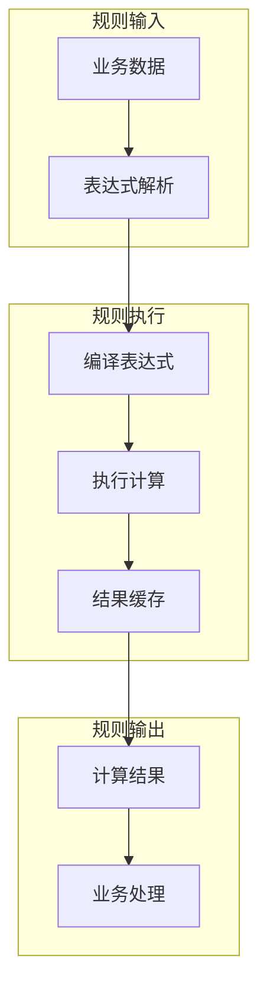

# pms-rules 数据库文档

## 1. 数据库表概览

pms-rules 模块**不直接管理任何数据库表**，仅提供基于 Aviator 的规则计算能力，不涉及持久化层。

> 规则表达式存储在调用方（如 PMS-struts、pms-ext-fp）的业务配置中，而非 pms-rules 模块管理的表。规则计算的输入数据（如 `pm_project`、`pm_project_header` 等表）由其他业务模块管理，pms-rules 仅在运行时接收 Map 形式的业务数据作为表达式变量环境。详见 `no-database.md`。

---

## 2. 规则配置

### 2.1 Aviator 规则配置

```java
// 规则表达式示例
String expression = "price * quantity * (1 - discount)";

// 变量定义
Map<String, Object> env = new HashMap<>();
env.put("price", 100);
env.put("quantity", 5);
env.put("discount", 0.1);

// 执行计算
Object result = AviatorUtils.exceute(expression, env);
// 结果: 450.0
```

### 2.2 规则缓存配置

```java
// 缓存大小配置
AviatorUtils.setCacheSize(200);

// 清空缓存
AviatorUtils.resetAviator();
```

---

## 3. 规则执行流程


