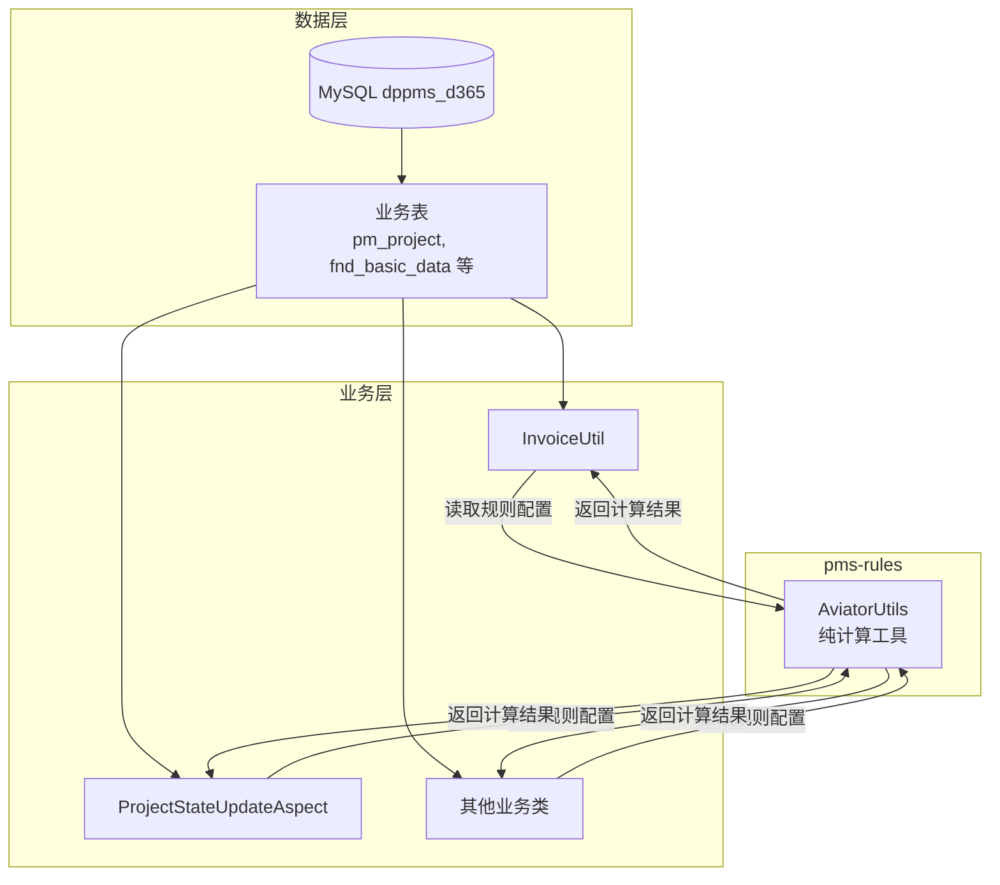
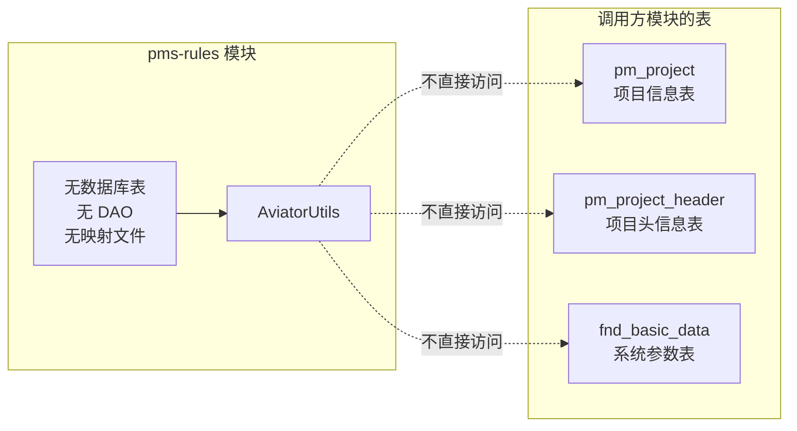
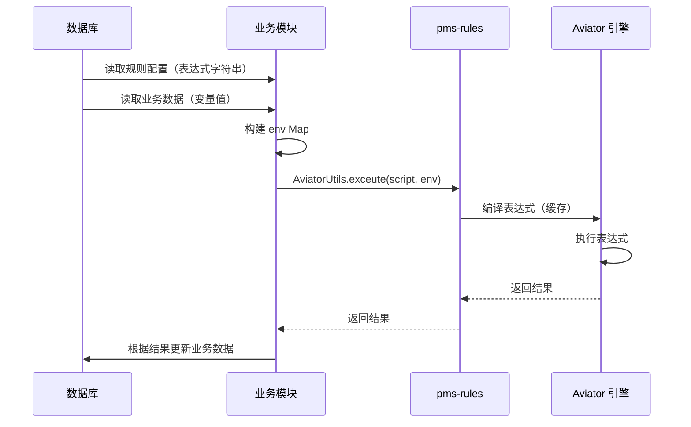

# pms-rules 数据库说明

> 本文档说明 pms-rules 模块与数据库的关系。pms-rules 是纯工具库模块，不直接管理任何数据库表。

---

## 1. 模块数据库定位

### 1.1 无数据库表

pms-rules 模块是一个**纯工具库**，不包含任何数据库表定义、DAO 层、ORM 映射文件或数据库连接配置。

| 项目 | 内容 |
|------|------|
| **数据库表数量** | 0 |
| **DAO 接口数量** | 0 |
| **MyBatis/iBatis 映射文件** | 0 |
| **数据库连接配置** | 无（依赖调用方模块的数据源） |
| **JPA 实体** | 0 |

### 1.2 模块定位



pms-rules 仅提供表达式求值能力，**不直接访问数据库**。规则表达式的存储和读取由调用方模块负责。

---

## 2. 规则表达式的存储位置

虽然 pms-rules 本身无数据库表，但规则表达式存储在 PMS 系统的其他表中：

### 2.1 系统参数表（fnd_basic_data）

| 字段 | 说明 |
|------|------|
| `code` | 参数编码 |
| `text_value` | 参数值（存储 Aviator 表达式） |

**相关参数编码**：

| 参数编码 | 用途 | 使用场景 |
|----------|------|----------|
| `SUBCONTRACT_INSPECTION_DELIVERY_CHECK_INVOICE_CONDITION` | 分包发票类型判断条件 | SubcontractUtil.checkDeliveryInvoiceType |
| `SUBCONTRACT_INSPECTION_DELIVERY_CHECK_INVOICE_STATUS_CONDITION` | 分包发票状态判断条件 | SubcontractUtil.checkDeliveryInvoiceStatus |

### 2.2 业务配置 JSON

规则表达式也存储在业务模块的配置 JSON 中，通过 `config.scripts` 字段传递：

```json
{
  "scripts": {
    "script1": {
      "condition": "entity.projectState == 30",
      "script": "entity.projectState = 31"
    },
    "script2": {
      "script": "setProjectType(presales, '销售测试')"
    }
  }
}
```

**使用场景**：

| 配置来源 | 使用场景 |
|----------|----------|
| `config.scripts` | 项目状态更新、售前项目自动启动、派工结算更新 |
| `config.invoiceTypeCondition` | 发票类型判断（pms-ext-fp） |
| `config.invoiceStatusCondition` | 发票状态判断（pms-ext-fp） |
| `invoice.condition` | 发票数据内嵌的条件（回退来源） |

### 2.3 Activiti 流程定义

工作流多实例节点的完成条件表达式存储在 Activiti 流程定义 XML 中：

```xml
<!-- Activiti 流程定义中的多实例完成条件 -->
<multiInstanceLoopCharacteristics isSequential="false"
    activiti:collection="${assigneeList}"
    activiti:elementVariable="assignee">
    <completionCondition>${nrOfCompletedInstances/nrOfInstances >= 0.5}</completionCondition>
</multiInstanceLoopCharacteristics>
```

**使用场景**：`WorkflowUtil.callBackProcess` 中提取 `completionCondition` 的变量名。

---

## 3. 与现有 database-overview.md 的关系

现有的 `database-overview.md` 描述了 pms-rules 的「关联表」（`pm_project`、`pm_project_header`），这些表是**调用方模块**管理的表，pms-rules 本身不操作这些表。



---

## 4. 数据流说明



### 4.1 数据流步骤

| 步骤 | 操作 | 执行者 | 数据库访问 |
|------|------|--------|------------|
| 1 | 读取规则配置 | 业务模块 | ✅ 读取 fnd_basic_data 等 |
| 2 | 读取业务数据 | 业务模块 | ✅ 读取 pm_project 等 |
| 3 | 构建 env Map | 业务模块 | ❌ 内存操作 |
| 4 | 执行表达式 | pms-rules | ❌ 纯计算 |
| 5 | 返回结果 | pms-rules | ❌ 内存操作 |
| 6 | 更新业务数据 | 业务模块 | ✅ 写入 pm_project 等 |

> **关键点**：pms-rules 仅参与步骤 4-5，不涉及任何数据库操作。

---

## 5. 总结

| 问题 | 答案 |
|------|------|
| pms-rules 有数据库表吗？ | **没有**，是纯工具库 |
| 规则表达式存储在哪？ | 系统参数表、业务配置 JSON、Activiti 流程定义 |
| pms-rules 访问数据库吗？ | **不访问**，由调用方模块负责数据读写 |
| pms-rules 需要 DAO 吗？ | **不需要** |
| pms-rules 需要数据源配置吗？ | **不需要** |
