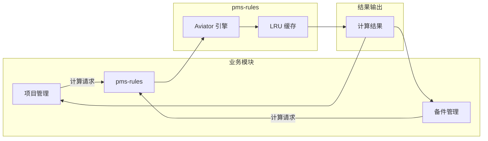

# pms-rules 模块-表CRUD映射矩阵

> 数据库：dppms_d365 (MySQL)
> pms-rules 模块**不直接管理任何数据库表**，仅提供规则计算能力。规则表达式存储在调用方的业务配置中。

---

## 1. 规则执行映射

### 1.1 规则计算流程

| 步骤 | 操作 | 说明 |
|------|------|------|
| 1 | 输入数据 | 从业务模块获取计算数据 |
| 2 | 表达式解析 | 解析 Aviator 表达式 |
| 3 | 编译表达式 | 编译并缓存表达式 |
| 4 | 执行计算 | 执行表达式计算 |
| 5 | 输出结果 | 返回计算结果 |

---

## 2. 数据流向图



---

## 3. 规则类型

### 3.1 数学计算规则

```java
// 价格计算
String expression = "price * quantity * (1 - discount)";
Object result = AviatorUtils.exceute(expression, env);
```

### 3.2 逻辑判断规则

```java
// 条件判断
String expression = "age >= 18 && age <= 60";
Object result = AviatorUtils.exceute(expression, env);
```

### 3.3 字符串处理规则

```java
// 字符串拼接
String expression = "string.join(' ', firstName, lastName)";
Object result = AviatorUtils.exceute(expression, env);
```
