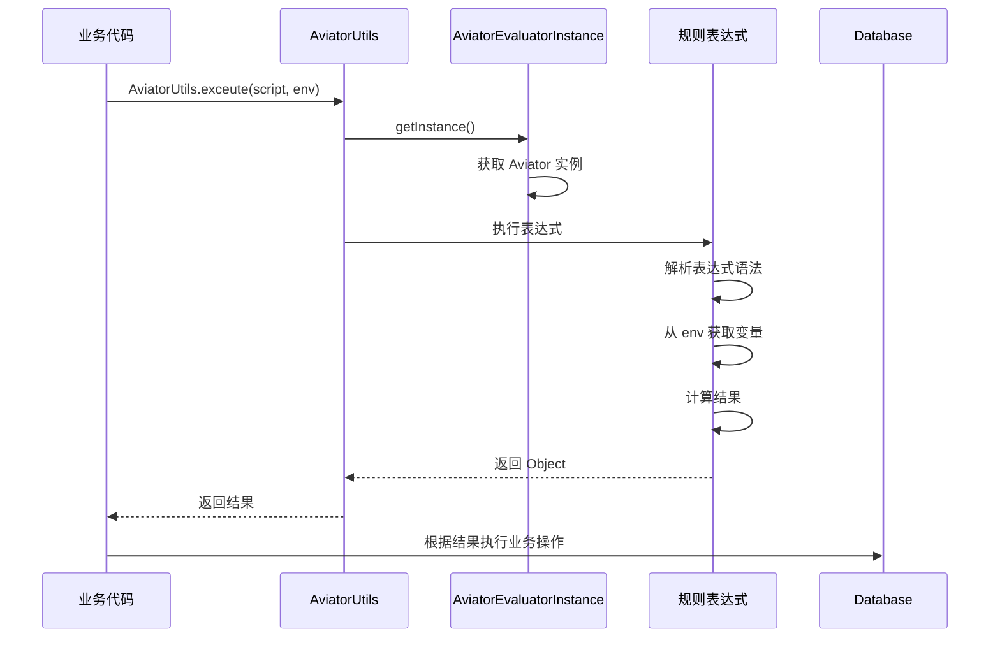
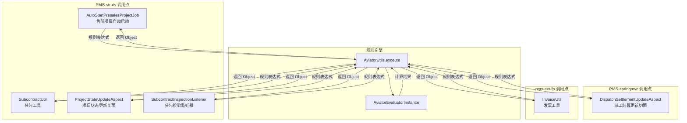
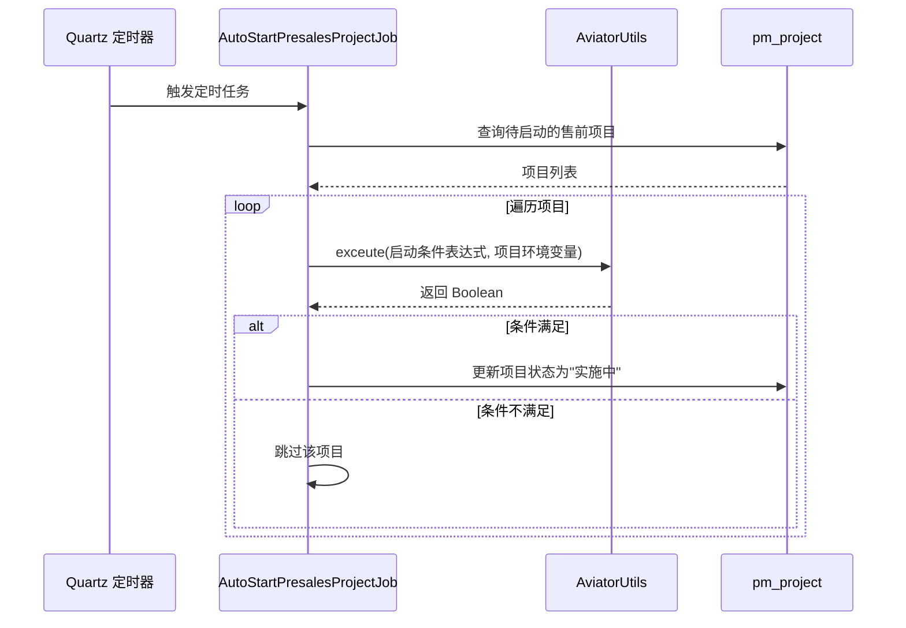
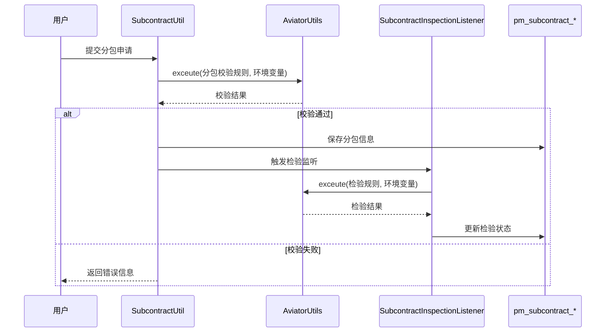
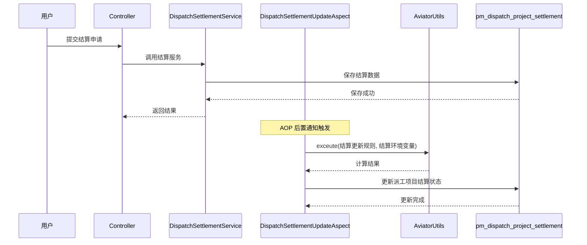
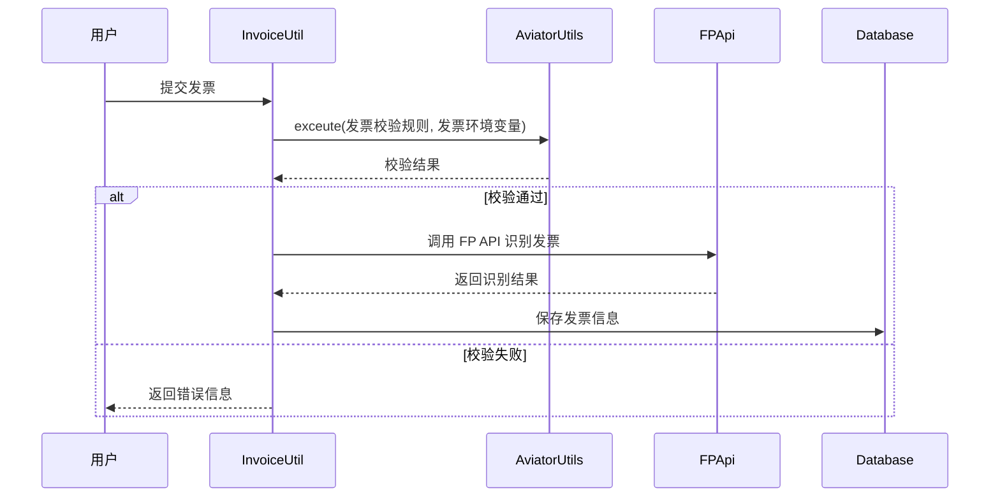
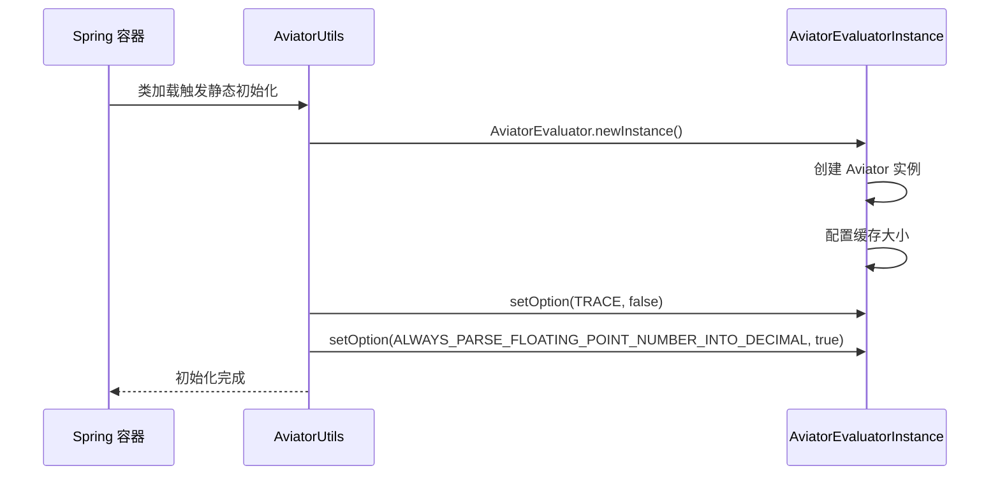
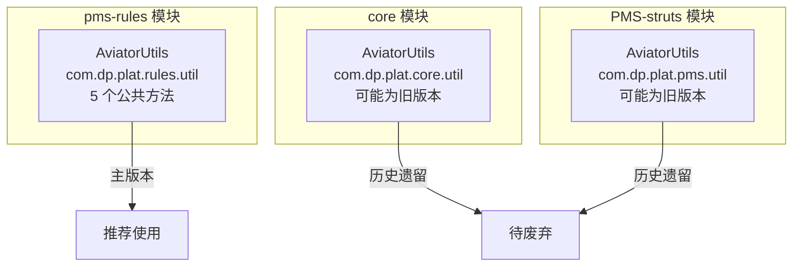

# pms-rules 数据流图

## 1. 规则引擎整体数据流

### 1.1 规则执行流程

```mermaid
sequenceDiagram
    participant B as 业务代码
    participant A as AviatorUtils
    participant E as AviatorEvaluatorInstance
    participant R as 规则表达式
    participant DB as Database

    B->>A: AviatorUtils.exceute(script, env)
    A->>E: getInstance()
    E->>E: 获取 Aviator 实例
    A->>R: 执行表达式
    R->>R: 解析表达式语法
    R->>R: 从 env 获取变量
    R->>R: 计算结果
    R-->>A: 返回 Object
    A-->>B: 返回结果
    B->>DB: 根据结果执行业务操作
```

### 1.2 6 个调用点数据流

```mermaid
graph TB
    subgraph PMS-struts 调用点
        A1[AutoStartPresalesProjectJob<br/>售前项目自动启动]
        A2[SubcontractUtil<br/>分包工具]
        A3[ProjectStateUpdateAspect<br/>项目状态更新切面]
        A4[SubcontractInspectionListener<br/>分包检验监听器]
    end

    subgraph PMS-springmvc 调用点
        B1[DispatchSettlementUpdateAspect<br/>派工结算更新切面]
    end

    subgraph pms-ext-fp 调用点
        C1[InvoiceUtil<br/>发票工具]
    end

    subgraph 规则引擎
        R[AviatorUtils.exceute]
        E[AviatorEvaluatorInstance]
    end

    A1 -->|规则表达式| R
    A2 -->|规则表达式| R
    A3 -->|规则表达式| R
    A4 -->|规则表达式| R
    B1 -->|规则表达式| R
    C1 -->|规则表达式| R

    R --> E
    E -->|计算结果| R
    R -->|返回 Object| A1
    R -->|返回 Object| A2
    R -->|返回 Object| A3
    R -->|返回 Object| A4
    R -->|返回 Object| B1
    R -->|返回 Object| C1
```

## 2. 售前项目自动启动数据流

```mermaid
sequenceDiagram
    participant Q as Quartz 定时器
    participant J as AutoStartPresalesProjectJob
    participant A as AviatorUtils
    participant DB as pm_project

    Q->>J: 触发定时任务
    J->>DB: 查询待启动的售前项目
    DB-->>J: 项目列表
    loop 遍历项目
        J->>A: exceute(启动条件表达式, 项目环境变量)
        A-->>J: 返回 Boolean
        alt 条件满足
            J->>DB: 更新项目状态为"实施中"
        else 条件不满足
            J->>J: 跳过该项目
        end
    end
```

## 3. 分包管理规则数据流

```mermaid
sequenceDiagram
    participant U as 用户
    participant A as SubcontractUtil
    participant R as AviatorUtils
    participant L as SubcontractInspectionListener
    participant DB as pm_subcontract_*

    U->>A: 提交分包申请
    A->>R: exceute(分包校验规则, 环境变量)
    R-->>A: 校验结果
    alt 校验通过
        A->>DB: 保存分包信息
        A->>L: 触发检验监听
        L->>R: exceute(检验规则, 环境变量)
        R-->>L: 检验结果
        L->>DB: 更新检验状态
    else 校验失败
        A-->>U: 返回错误信息
    end
```

## 4. 派工结算更新数据流

```mermaid
sequenceDiagram
    participant U as 用户
    participant C as Controller
    participant S as DispatchSettlementService
    participant ASP as DispatchSettlementUpdateAspect
    participant A as AviatorUtils
    participant DB as pm_dispatch_project_settlement

    U->>C: 提交结算申请
    C->>S: 调用结算服务
    S->>DB: 保存结算数据
    DB-->>S: 保存成功
    S-->>C: 返回结果

    Note over ASP: AOP 后置通知触发
    ASP->>A: exceute(结算更新规则, 结算环境变量)
    A-->>ASP: 计算结果
    ASP->>DB: 更新派工项目结算状态
    DB-->>ASP: 更新完成
```

## 5. 发票处理规则数据流

```mermaid
sequenceDiagram
    participant U as 用户
    participant I as InvoiceUtil
    participant A as AviatorUtils
    participant F as FPApi
    participant DB as Database

    U->>I: 提交发票
    I->>A: exceute(发票校验规则, 发票环境变量)
    A-->>I: 校验结果
    alt 校验通过
        I->>F: 调用 FP API 识别发票
        F-->>I: 返回识别结果
        I->>DB: 保存发票信息
    else 校验失败
        I-->>U: 返回错误信息
    end
```

## 6. 规则引擎初始化流程

```mermaid
sequenceDiagram
    participant S as Spring 容器
    participant A as AviatorUtils
    participant E as AviatorEvaluatorInstance

    S->>A: 类加载触发静态初始化
    A->>E: AviatorEvaluator.newInstance()
    E->>E: 创建 Aviator 实例
    E->>E: 配置缓存大小
    A->>E: setOption(TRACE, false)
    A->>E: setOption(ALWAYS_PARSE_FLOATING_POINT_NUMBER_INTO_DECIMAL, true)
    A-->>S: 初始化完成
```

## 7. 三处重复定义的关系

```mermaid
graph TB
    subgraph pms-rules 模块
        A1[AviatorUtils<br/>com.dp.plat.rules.util<br/>5 个公共方法]
    end

    subgraph core 模块
        A2[AviatorUtils<br/>com.dp.plat.core.util<br/>可能为旧版本]
    end

    subgraph PMS-struts 模块
        A3[AviatorUtils<br/>com.dp.plat.pms.util<br/>可能为旧版本]
    end

    A1 -->|主版本| B[推荐使用]
    A2 -->|历史遗留| C[待废弃]
    A3 -->|历史遗留| C
```
