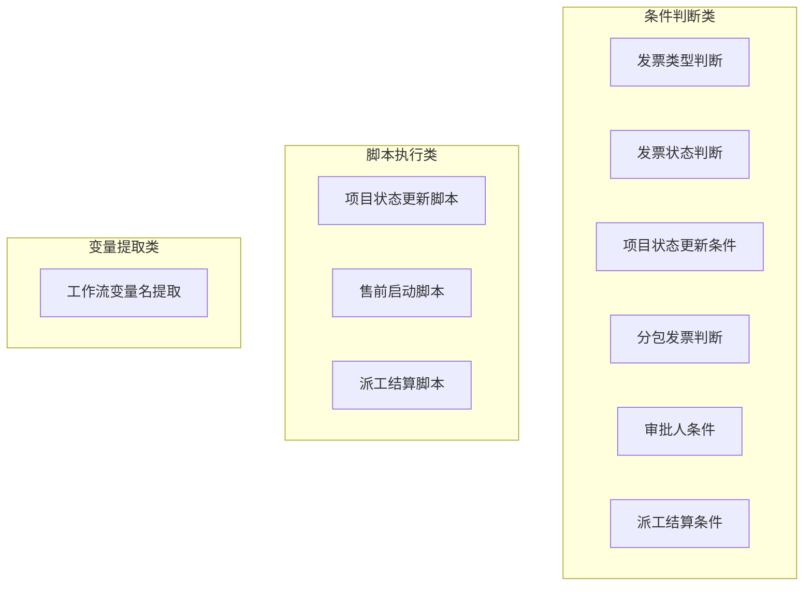
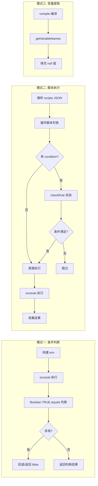
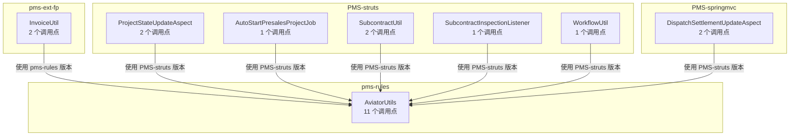

# 规则使用矩阵

> 本文档以矩阵形式呈现 PMS 系统各业务模块使用 AviatorUtils 的调用点、表达式内容、变量环境和返回值处理。

---

## 1. 使用矩阵总览

### 1.1 完整调用矩阵

| 序号 | 模块 | 调用类 | 方法 | 行号 | 业务场景 | 表达式来源 | 返回值处理 | 异常处理 |
|------|------|--------|------|------|----------|------------|------------|----------|
| 1 | pms-ext-fp | InvoiceUtil | checkFileInvoiceType | 117 | 发票类型判断 | config.invoiceTypeCondition | `Boolean.TRUE.equals(result)` | 回退默认逻辑 |
| 2 | pms-ext-fp | InvoiceUtil | checkFileInvoiceStatus | 147 | 发票状态判断 | config.invoiceStatusCondition | `Boolean.TRUE.equals(result)` | 回退默认逻辑 |
| 3 | PMS-struts | ProjectStateUpdateAspect | checkRule | 259 | 状态更新条件 | rule.condition | `Boolean.TRUE.equals(result)` | 返回 false |
| 4 | PMS-struts | ProjectStateUpdateAspect | execScripts | 354 | 状态更新脚本 | script.script | 收集到 results 列表 | 抛 CustomRuntimeException |
| 5 | PMS-struts | AutoStartPresalesProjectJob | execScripts | 248 | 售前启动脚本 | script.script | 收集到 results 列表 | 抛 CustomRuntimeException |
| 6 | PMS-struts | SubcontractUtil | checkDeliveryInvoiceType | 51 | 分包发票类型 | 系统参数 | `Boolean.TRUE.equals(result)` | 回退默认逻辑 |
| 7 | PMS-struts | SubcontractUtil | checkDeliveryInvoiceStatus | 72 | 分包发票状态 | 系统参数 | `Boolean.TRUE.equals(result)` | 回退默认逻辑 |
| 8 | PMS-struts | SubcontractInspectionListener | checkAssignee | 668 | 审批人条件 | approverConfig.condition | `Boolean.TRUE.equals(result)` | 返回 false |
| 9 | PMS-struts | WorkflowUtil | callBackProcess | 114 | 变量名提取 | Activiti completionCondition | `expr.getVariableNames()` | 外层处理 |
| 10 | PMS-springmvc | DispatchSettlementUpdateAspect | checkRule | 292 | 派工结算条件 | rule.condition | `Boolean.TRUE.equals(result)` | 返回 false |
| 11 | PMS-springmvc | DispatchSettlementUpdateAspect | execScripts | 390 | 派工结算脚本 | script.script | 收集到 results 列表 | 抛 CustomRuntimeException |

---

## 2. 变量环境矩阵

### 2.1 各调用点的 env 变量

| 调用点 | entity | config | configs | context | taskVars | 其他 |
|--------|--------|--------|---------|---------|----------|------|
| InvoiceUtil.checkFileInvoiceType | `{"entity": invoice}` | — | — | — | — | — |
| InvoiceUtil.checkFileInvoiceStatus | `{"entity": invoice}` | — | — | — | — | — |
| ProjectStateUpdateAspect.checkRule | 业务实体 | rule | — | this | — | — |
| ProjectStateUpdateAspect.execScripts | entity Map | script | config | this | — | — |
| AutoStartPresalesProjectJob.execScripts | entity Map | config | — | this | — | — |
| SubcontractUtil.checkDeliveryInvoiceType | `{"entity": invoice}` | — | — | — | — | — |
| SubcontractUtil.checkDeliveryInvoiceStatus | `{"entity": invoice}` | — | — | — | — | — |
| SubcontractInspectionListener.checkAssignee | 业务实体 | approverConfig | — | this | variableScope | — |
| WorkflowUtil.callBackProcess | — | — | — | — | — | 编译模式，无 env |
| DispatchSettlementUpdateAspect.checkRule | 业务实体 | rule | — | this | — | — |
| DispatchSettlementUpdateAspect.execScripts | entity Map | script | config | this | — | — |

### 2.2 entity 结构类型

```mermaid
graph TB
    subgraph 嵌套 Map 结构
        A1[env.entity] --> A2[Map: {"entity": invoice}]
        A2 --> A3[表达式访问: entity.entity.xxx]
    end
    
    subgraph 直接对象结构
        B1[env.entity] --> B2[业务实体对象/Map]
        B2 --> B3[表达式访问: entity.xxx]
    end
    
    subgraph 复合 Map 结构
        C1[env.entity] --> C2[Map 含 project/presales/target 子键]
        C2 --> C3[表达式访问: entity.project.xxx]
    end
```

| 调用点 | entity 结构 | 表达式访问方式 |
|--------|-------------|----------------|
| InvoiceUtil | 嵌套 Map `{"entity": invoice}` | `entity.entity.字段名` |
| SubcontractUtil | 嵌套 Map `{"entity": invoice}` | `entity.entity.字段名` |
| ProjectStateUpdateAspect.checkRule | 直接对象 | `entity.字段名` |
| ProjectStateUpdateAspect.execScripts | 复合 Map（含 project） | `entity.project.字段名` |
| AutoStartPresalesProjectJob | 复合 Map（含 presales） | `entity.presales.字段名` |
| SubcontractInspectionListener | 直接对象 | `entity.字段名` |
| DispatchSettlementUpdateAspect | 复合 Map（含 target） | `entity.target.字段名` |

---

## 3. 表达式类型矩阵

### 3.1 按表达式用途分类



| 类型 | 调用点 | 表达式特征 | 返回值类型 |
|------|--------|------------|------------|
| **条件判断** | 1, 2, 3, 6, 7, 8, 10 | 逻辑表达式，返回 Boolean | `Boolean` |
| **脚本执行** | 4, 5, 11 | 赋值/方法调用，返回任意 | `Object`（可能为 null） |
| **变量提取** | 9 | 编译表达式，不执行 | `List<String>`（变量名） |

### 3.2 表达式来源矩阵

| 来源 | 调用点 | 存储位置 | 可热更新 |
|------|--------|----------|----------|
| 系统参数表 | 6, 7 | `fnd_basic_data.text_value` | ✅ 是 |
| 业务配置 JSON | 1, 2, 3, 4, 5, 10, 11 | `config.scripts` / `config.*Condition` | ✅ 是 |
| 发票数据内嵌 | 1, 2, 6, 7（回退） | `invoice.condition` | ✅ 是 |
| Activiti 流程定义 | 9 | 流程 XML `completionCondition` | ❌ 需重新部署流程 |

---

## 4. 调用模式矩阵

### 4.1 三种调用模式



### 4.2 模式对照表

| 模式 | 调用点 | AviatorUtils 方法 | 返回值处理 | 典型用法 |
|------|--------|-------------------|------------|----------|
| 条件判断 | 1, 2, 3, 6, 7, 8, 10 | `exceute(condition, env)` | `Boolean.TRUE.equals(result)` | 规则启用条件校验 |
| 脚本执行 | 4, 5, 11 | `exceute(script, env)` | 收集到 List | 批量执行配置脚本 |
| 变量提取 | 9 | `getInstance().compile(text)` | `expr.getVariableNames()` | 提取表达式变量名 |

---

## 5. 异常处理矩阵

| 调用点 | try-catch | 日志方式 | 失败行为 | 影响范围 |
|--------|-----------|----------|----------|----------|
| InvoiceUtil.checkFileInvoiceType | `catch(Exception)` | `e.printStackTrace()` | 回退默认逻辑 | 单条发票判断 |
| InvoiceUtil.checkFileInvoiceStatus | `catch(Exception)` | `e.printStackTrace()` | 回退默认逻辑 | 单条发票判断 |
| ProjectStateUpdateAspect.checkRule | `catch(Exception)` | `logError` | 返回 false | 单条规则跳过 |
| ProjectStateUpdateAspect.execScripts | `catch(Exception)` | `logError` + 收集 | 抛 CustomRuntimeException | 中断状态更新 |
| AutoStartPresalesProjectJob.execScripts | `catch(Exception)` | `e.printStackTrace()` | 抛 CustomRuntimeException | 中断售前启动 |
| SubcontractUtil.checkDelivery* | `catch(Exception)` | `e.printStackTrace()` | 回退默认逻辑 | 单条发票判断 |
| SubcontractInspectionListener.checkAssignee | `catch(Exception)` | `e.printStackTrace()` | 返回 false | 审批人跳过 |
| WorkflowUtil.callBackProcess | 外层处理 | — | — | 工作流执行 |
| DispatchSettlementUpdateAspect.checkRule | `catch(Exception)` | `logError` | 返回 false | 单条规则跳过 |
| DispatchSettlementUpdateAspect.execScripts | `catch(Exception)` | `logError` + 收集 | 抛 CustomRuntimeException | 中断结算更新 |

### 5.1 异常处理问题汇总

| 问题 | 涉及调用点 | 风险等级 | 建议 |
|------|------------|----------|------|
| `printStackTrace` 替代日志框架 | 1, 2, 5, 6, 7, 8 | 中 | 改用 `log.error` |
| 静默返回 false 无告警 | 3, 8, 10 | 中 | 增加监控告警 |
| 异常信息丢失堆栈 | 4, 5, 11 | 低 | 保留完整异常对象 |
| 无异常处理 | 9 | 低 | 外层已有处理 |

---

## 6. 模块-调用点关系图



### 6.1 调用点统计

| 模块 | 调用类数量 | 调用点数量 | 使用版本 |
|------|------------|------------|----------|
| pms-ext-fp | 1 | 2 | pms-rules 版本 |
| PMS-struts | 5 | 7 | PMS-struts 版本 |
| PMS-springmvc | 1 | 2 | PMS-struts 版本 |
| **合计** | **7** | **11** | — |

> **注意**：pms-ext-fp 是唯一直接依赖 pms-rules 模块并使用其 AviatorUtils 版本的模块。PMS-struts 和 PMS-springmvc 使用各自 classpath 中的副本。
