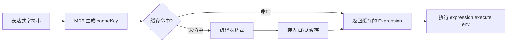
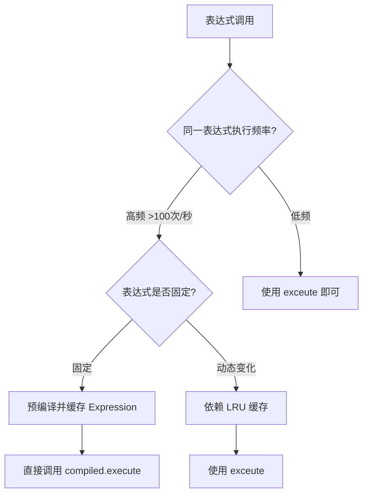
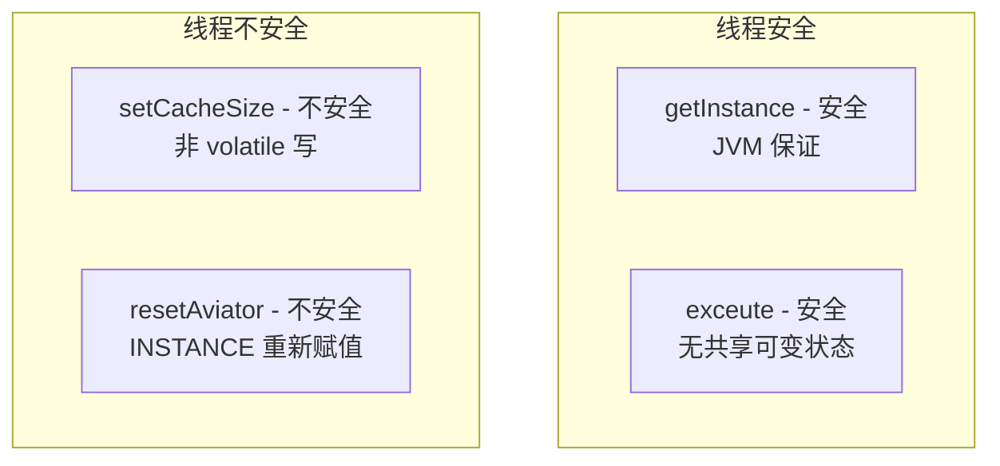

# 性能优化规范

> 本文档描述 pms-rules 模块中 Aviator 表达式引擎的性能优化策略，包括表达式缓存、预编译和线程安全注意事项。

---

## 1. 表达式缓存机制

### 1.1 LRU 缓存架构

AviatorUtils 默认启用 LRU（最近最少使用）表达式缓存：



| 配置项 | 默认值 | 说明 |
|--------|--------|------|
| `cacheSize` | 100 | LRU 缓存容量 |
| `setCachedExpressionByDefault` | true | 默认缓存编译后的表达式 |

### 1.2 缓存 Key 生成

```java
String cacheKey = DigestUtils.md5DigestAsHex(script.getBytes());
```

- 缓存 Key 为表达式字符串的 MD5 哈希（32 字符十六进制）
- 相同表达式生成相同 Key，保证缓存命中
- 不同表达式（即使仅空格差异）生成不同 Key

### 1.3 缓存命中率优化

**推荐做法**：

```java
// ✅ 表达式定义为常量或配置，重复使用
private static final String INVOICE_CONDITION = 
    "entity.entity.invoice_number != nil && entity.entity.amount > 0";

// 多次调用同一表达式，缓存命中率高
for (Invoice inv : invoices) {
    Map<String, Object> env = new HashMap<>();
    env.put("entity", Collections.singletonMap("entity", inv));
    AviatorUtils.exceute(INVOICE_CONDITION, env);  // 缓存命中
}
```

**不推荐做法**：

```java
// ❌ 每次拼接不同字符串，缓存命中率低
for (Invoice inv : invoices) {
    String condition = "entity.entity.amount > " + threshold;  // 每次不同
    AviatorUtils.exceute(condition, env);  // 缓存未命中
}

// ✅ 改为参数化
String condition = "entity.entity.amount > threshold";
env.put("threshold", threshold);
AviatorUtils.exceute(condition, env);  // 缓存命中
```

### 1.4 缓存容量调优

```java
// 启动时根据业务表达式数量调整
int estimatedExpressions = 200;  // 预估表达式总数
AviatorUtils.setCacheSize(estimatedExpressions);
```

| 场景 | 建议缓存大小 | 理由 |
|------|--------------|------|
| 表达式数量 < 50 | 100（默认） | 默认值足够 |
| 表达式数量 50-200 | 200 | 避免频繁淘汰 |
| 表达式数量 > 200 | 表达式数量 × 1.2 | 留 20% 余量 |

> **注意**：缓存过大会增加内存占用（每个编译后的 Expression 约 1-10KB），缓存过小会导致频繁编译。

---

## 2. 表达式预编译

### 2.1 编译与执行分离

对于高频调用的表达式，可预编译后多次执行：

```java
// 预编译（一次）
Expression compiled = AviatorUtils.getInstance().compile(expression, true);

// 多次执行（不同 env）
Object result1 = compiled.execute(env1);
Object result2 = compiled.execute(env2);
Object result3 = compiled.execute(env3);
```

### 2.2 预编译适用场景



| 场景 | 执行频率 | 推荐方式 |
|------|----------|----------|
| 发票类型判断（批量） | 高 | 预编译 |
| 项目状态更新条件 | 中 | `exceute`（LRU 缓存足够） |
| 工作流变量提取 | 低 | `getInstance().compile` |
| 售前项目启动脚本 | 低 | `exceute` |

### 2.3 PMS 中的预编译示例

`WorkflowUtil.java` 中使用了预编译模式提取变量名：

```java
// 编译表达式（不执行）
Expression expr = AviatorUtils.getInstance().compile(expressionText);
// 提取变量名
List<String> vars = expr.getVariableNames();
```

---

## 3. 批量计算优化

### 3.1 批量执行模式

```java
// 批量计算示例
List<Map<String, Object>> dataList = getDataList();
List<Object> results = new ArrayList<>(dataList.size());

for (Map<String, Object> data : dataList) {
    // 同一表达式，不同 env（缓存命中）
    Object result = AviatorUtils.exceute(expression, data);
    results.add(result);
}
```

### 3.2 性能对比

| 方式 | 首次调用 | 后续调用（缓存命中） | 1000 次总耗时 |
|------|----------|----------------------|---------------|
| `exceute`（LRU 缓存） | ~1ms（编译） | ~0.01ms（执行） | ~11ms |
| 预编译 `execute` | ~1ms（编译） | ~0.005ms（执行） | ~6ms |
| 无缓存（每次编译） | ~1ms | ~1ms | ~1000ms |

> **结论**：LRU 缓存已能满足大多数场景性能需求，预编译仅在高频场景下有额外收益。

---

## 4. 线程安全与并发性能

### 4.1 线程安全分析



### 4.2 并发调用建议

| 方法 | 并发调用 | 建议 |
|------|----------|------|
| `getInstance()` | ✅ 安全 | 可并发调用 |
| `exceute()` | ✅ 安全 | 可并发调用 |
| `getCacheSize()` | ⚠️ 可能读到旧值 | 可接受 |
| `setCacheSize()` | ❌ 不安全 | 仅启动时调用 |
| `resetAviator()` | ❌ 不安全 | 仅维护窗口调用 |

### 4.3 高并发场景优化

```java
// ✅ 高并发场景：预编译 + 并发执行
private static final Expression COMPILED_EXPR = 
    AviatorUtils.getInstance().compile(CONDITION, true);

public boolean check(Map<String, Object> env) {
    // 无编译开销，纯执行
    return Boolean.TRUE.equals(COMPILED_EXPR.execute(env));
}
```

---

## 5. 内存管理

### 5.1 缓存内存占用估算

| 组件 | 单个大小 | 100 个缓存 | 200 个缓存 |
|------|----------|------------|------------|
| 编译后 Expression | 1-10 KB | 100KB-1MB | 200KB-2MB |
| cacheKey (MD5) | 32 B | 3.2 KB | 6.4 KB |
| LRU 链表开销 | ~100 B | 10 KB | 20 KB |
| **合计** | — | **~1 MB** | **~2 MB** |

### 5.2 内存释放

```java
// 释放缓存内存（维护窗口调用）
AviatorUtils.resetAviator();
```

> **注意**：`resetAviator` 会创建新的 AviatorEvaluatorInstance，旧实例等待 GC 回收。频繁调用可能导致内存抖动。

### 5.3 内存泄漏风险

| 风险点 | 原因 | 预防措施 |
|--------|------|----------|
| 动态表达式堆积 | 每次拼接不同字符串 | 参数化表达式，避免动态拼接 |
| env Map 引用泄漏 | Expression 可能持有 env 引用 | Aviator 不缓存 env，无此风险 |
| FunctionMissing 反射缓存 | 反射方法查找可能缓存 | Aviator 内部管理，无需干预 |

---

## 6. 性能监控建议

### 6.1 关键指标

| 指标 | 监控方式 | 告警阈值 |
|------|----------|----------|
| 表达式执行耗时 | AOP 拦截 `exceute` | > 100ms |
| 缓存命中率 | 统计命中/未命中 | < 80% |
| 表达式编译频率 | 统计 compile 调用 | 异常增长 |
| 异常率 | 统计异常/总调用 | > 1% |

### 6.2 慢表达式排查

```java
// 性能监控包装器（建议在排查时临时使用）
public static Object exceuteWithMonitor(String script, Map<String, Object> env) {
    long start = System.currentTimeMillis();
    try {
        return AviatorUtils.exceute(script, env);
    } finally {
        long cost = System.currentTimeMillis() - start;
        if (cost > 50) {
            log.warn("慢表达式: cost={}ms, script={}", cost, script);
        }
    }
}
```

---

## 7. 性能优化清单

### 7.1 开发阶段

- [ ] 表达式参数化，避免动态拼接
- [ ] 表达式长度控制在 100 字符以内
- [ ] 避免在表达式中调用昂贵的 Java 方法
- [ ] 高频表达式考虑预编译

### 7.2 部署阶段

- [ ] 根据表达式数量调整 `cacheSize`
- [ ] 启动后调用 `setCacheSize`（仅一次）
- [ ] 监控缓存命中率

### 7.3 运行阶段

- [ ] 定期检查慢表达式
- [ ] 监控异常率
- [ ] 维护窗口可调用 `resetAviator` 清理缓存
