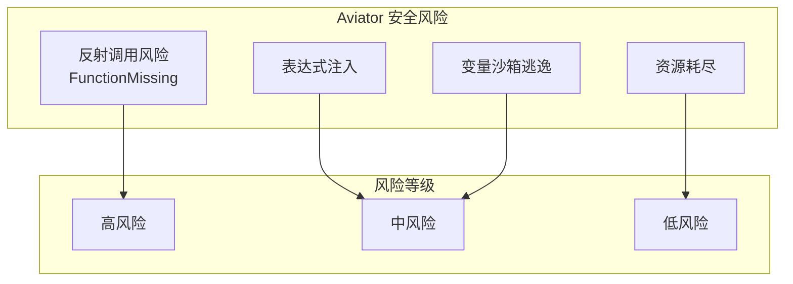
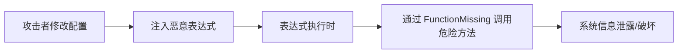
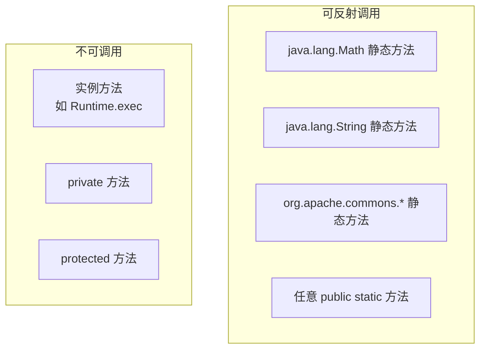
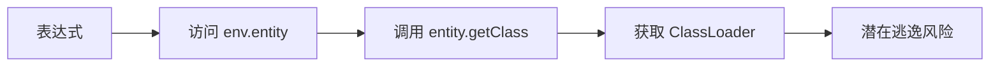
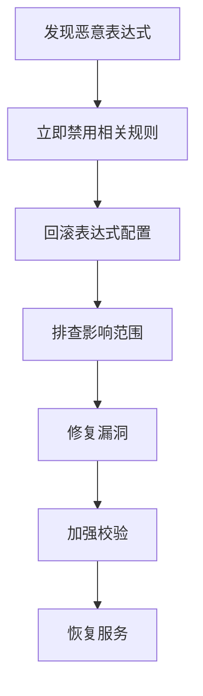

# 安全实践规范

> 本文档描述 pms-rules 模块中 Aviator 表达式引擎的安全风险和防护措施，包括表达式注入、变量沙箱和反射调用风险。

---

## 1. 安全风险概述



| 风险 | 等级 | 当前状态 | 说明 |
|------|------|----------|------|
| 表达式注入 | 中 | ⚠️ 部分防护 | 表达式来自配置，需校验 |
| 反射调用风险 | 高 | ⚠️ 已启用 FunctionMissing | 可调用任意 Java 静态方法 |
| 变量沙箱逃逸 | 中 | ⚠️ 无沙箱 | 表达式可访问 env 中所有对象 |
| 资源耗尽 | 低 | ✅ Aviator 无循环 | 表达式不支持循环 |

---

## 2. 表达式注入风险

### 2.1 风险描述

Aviator 表达式来源于配置（系统参数、JSON 配置），若配置可被未授权用户修改，可能导致表达式注入。

### 2.2 攻击场景



**潜在恶意表达式示例**：

```
// 通过反射调用 Runtime 执行系统命令（理论风险）
Runtime.getRuntime().exec('rm -rf /')

// 通过反射访问敏感数据
System.getProperty('user.home')
```

> **注意**：`JavaMethodReflectionFunctionMissing` 仅支持**静态方法**反射调用，`Runtime.getRuntime()` 是实例方法，实际无法直接调用。但 `System.getProperty()` 等静态方法可被调用。

### 2.3 防护措施

#### 2.3.1 配置权限控制

```java
// ✅ 校验用户是否有规则配置权限
if (!user.hasPermission("rule:config")) {
    throw new PermissionException("无权限修改规则配置");
}
```

#### 2.3.2 表达式白名单校验

```java
// ✅ 表达式保存前校验合法性
public void validateExpression(String expression) {
    // 禁止危险关键字
    Set<String> blacklist = Set.of(
        "Runtime", "ProcessBuilder", "System.exit", 
        "Class.forName", "ClassLoader", "Reflect"
    );
    for (String keyword : blacklist) {
        if (expression.contains(keyword)) {
            throw new SecurityException("表达式包含禁止的关键字: " + keyword);
        }
    }
}
```

#### 2.3.3 表达式审计日志

```java
// ✅ 记录表达式变更审计
@AuditLog(action = "RULE_UPDATE", description = "更新规则表达式")
public void updateRuleCondition(String ruleId, String condition) {
    auditLog.record("旧表达式: " + getOldCondition(ruleId));
    auditLog.record("新表达式: " + condition);
    auditLog.record("操作人: " + currentUser.getName());
    ruleDao.updateCondition(ruleId, condition);
}
```

---

## 3. FunctionMissing 反射风险

### 3.1 风险描述

`JavaMethodReflectionFunctionMissing` 允许表达式通过反射调用 Java 静态方法，这是 AviatorUtils 的核心配置：

```java
instance.setFunctionMissing(JavaMethodReflectionFunctionMissing.getInstance());
```

### 3.2 可调用的方法



### 3.3 风险评估

| 风险项 | 可利用性 | 影响 | 当前防护 |
|--------|----------|------|----------|
| `System.getProperty()` | 高 | 信息泄露 | 无 |
| `System.exit()` | 高 | 服务停止 | 无 |
| `Thread.sleep()` | 中 | DoS | 无 |
| `Math.*` | 无 | 正常使用 | — |

### 3.4 防护建议

#### 3.4.1 禁用 FunctionMissing（最安全）

```java
// ❌ 移除 FunctionMissing 配置（影响现有功能）
// instance.setFunctionMissing(JavaMethodReflectionFunctionMissing.getInstance());
```

> **注意**：PMS 业务表达式中使用了 `setProjectType(presales, ...)` 等通过 `context` 反射调用的方法，禁用 FunctionMissing 会导致这些脚本失效。

#### 3.4.2 自定义安全 FunctionMissing

```java
// ✅ 自定义 FunctionMissing，白名单控制
instance.setFunctionMissing(new AbstractFunctionMissing() {
    private final Set<String> ALLOWED_CLASSES = Set.of(
        "java.lang.Math",
        "java.lang.String",
        "com.dp.plat.util.StringUtils"
    );
    
    @Override
    public AviatorObject onFunctionMissing(String name, Map<String, Object> env, AviatorObject... args) {
        // 解析类名和方法名
        int lastDot = name.lastIndexOf('.');
        String className = name.substring(0, lastDot);
        String methodName = name.substring(lastDot + 1);
        
        // 白名单校验
        if (!ALLOWED_CLASSES.contains(className)) {
            throw new SecurityException("禁止调用: " + name);
        }
        
        // 反射调用
        return JavaMethodReflectionFunctionMissing.getInstance()
            .onFunctionMissing(name, env, args);
    }
});
```

#### 3.4.3 context 对象安全

PMS 表达式中通过 `context` 变量调用切面/Job 的方法：

```
// 调用 context 的方法（依赖 FunctionMissing 反射）
setProjectType(presales, '销售测试')
```

**风险**：`context` 是 Java 对象，表达式中可调用其所有 public 方法。

**防护**：context 对象应仅暴露必要的方法，敏感方法设为 private/protected。

---

## 4. 变量沙箱

### 4.1 当前状态

AviatorUtils 不实现变量沙箱，表达式中可访问 `env` Map 中的所有对象：

```java
Map<String, Object> env = new HashMap<>();
env.put("entity", entity);       // 表达式可访问 entity 的所有 public 方法
env.put("context", this);        // 表达式可访问 context 的所有 public 方法
env.put("config", config);       // 表达式可访问 config 的所有内容
```

### 4.2 风险场景



### 4.3 防护措施

#### 4.3.1 最小化 env 内容

```java
// ✅ 仅放入必要的变量
Map<String, Object> env = new HashMap<>();
env.put("entity", sanitizedEntity);  // 仅包含必要字段
// ❌ 不要放入整个 Service/DAO 对象
// env.put("service", projectService);  // 危险
```

#### 4.3.2 使用不可变 Map

```java
// ✅ 使用不可变 Map 防止表达式修改 env
Map<String, Object> env = Collections.unmodifiableMap(builder);
```

#### 4.3.3 entity 对象安全

```java
// ✅ 传入表达式的 entity 应为 DTO，仅暴露数据字段
public class InvoiceDTO {
    private String invoiceNumber;
    private BigDecimal amount;
    // 仅 getter，无业务方法
}
```

---

## 5. 输入验证

### 5.1 表达式长度限制

```java
// ✅ 限制表达式长度
public void validateExpression(String expression) {
    if (expression.length() > 500) {
        throw new IllegalArgumentException("表达式长度超过限制（500字符）");
    }
}
```

### 5.2 变量值类型校验

```java
// ✅ 校验 env 中的变量类型
public void validateEnv(Map<String, Object> env) {
    for (Map.Entry<String, Object> entry : env.entrySet()) {
        Object value = entry.getValue();
        if (value != null) {
            Class<?> clazz = value.getClass();
            // 仅允许基本类型、String、Map、List、业务 DTO
            if (!isAllowedType(clazz)) {
                throw new SecurityException("不允许的变量类型: " + clazz.getName());
            }
        }
    }
}
```

### 5.3 表达式复杂度限制

```java
// ✅ 限制表达式嵌套深度
public void validateComplexity(String expression) {
    int maxDepth = 5;
    int depth = 0;
    int maxDepthReached = 0;
    for (char c : expression.toCharArray()) {
        if (c == '(') depth++;
        if (c == ')') depth--;
        maxDepthReached = Math.max(maxDepthReached, depth);
    }
    if (maxDepthReached > maxDepth) {
        throw new IllegalArgumentException("表达式嵌套深度超过限制（" + maxDepth + "）");
    }
}
```

---

## 6. 安全检查清单

### 6.1 配置安全

- [ ] 规则配置接口有权限控制
- [ ] 表达式变更记录审计日志
- [ ] 表达式保存前进行白名单/黑名单校验
- [ ] 表达式长度和复杂度有限制

### 6.2 运行时安全

- [ ] env Map 仅包含必要变量
- [ ] context 对象仅暴露安全方法
- [ ] entity 对象为 DTO，无业务方法
- [ ] 表达式执行有超时控制（建议）

### 6.3 FunctionMissing 安全

- [ ] 评估是否需要 FunctionMissing
- [ ] 若需要，考虑自定义白名单 FunctionMissing
- [ ] 监控异常的反射调用

### 6.4 监控告警

- [ ] 表达式执行异常监控
- [ ] 表达式执行耗时监控
- [ ] 配置变更告警

---

## 7. 安全事件应急响应

### 7.1 表达式注入事件



### 7.2 应急操作

```java
// 紧急清空所有表达式缓存
AviatorUtils.resetAviator();

// 禁用特定规则
ruleService.disableRule(ruleId);

// 恢复默认表达式
ruleService.resetToDefault(ruleId);
```
