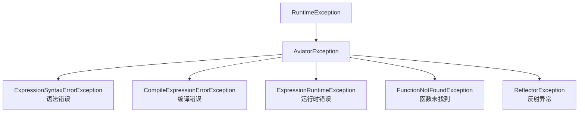
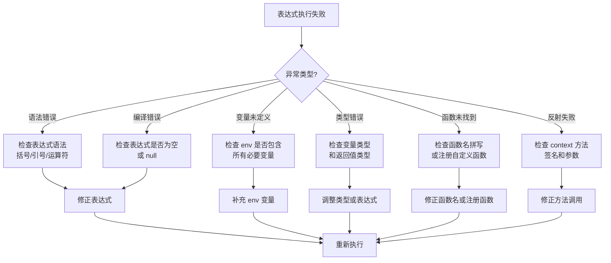

# 错误码与异常类型

> 本文档列出 pms-rules 模块中 Aviator 表达式引擎可能抛出的异常类型、错误信息和处理建议。

---

## 1. Aviator 异常体系



### 1.1 异常类清单

| 异常类 | 全限定名 | 触发阶段 | 严重程度 |
|--------|----------|----------|----------|
| `ExpressionSyntaxErrorException` | `com.googlecode.aviator.exception.ExpressionSyntaxErrorException` | 编译期 | 中 |
| `CompileExpressionErrorException` | `com.googlecode.aviator.exception.CompileExpressionErrorException` | 编译期 | 中 |
| `ExpressionRuntimeException` | `com.googlecode.aviator.exception.ExpressionRuntimeException` | 运行期 | 高 |
| `FunctionNotFoundException` | `com.googlecode.aviator.exception.FunctionNotFoundException` | 运行期 | 高 |
| `ReflectorException` | `com.googlecode.aviator.exception.ReflectorException` | 运行期 | 高 |

---

## 2. 异常详解

### 2.1 ExpressionSyntaxErrorException

| 项目 | 内容 |
|------|------|
| **触发阶段** | 表达式编译期 |
| **触发条件** | 表达式语法不合法 |

**常见原因**：

| 原因 | 示例 | 错误信息 |
|------|------|----------|
| 括号不匹配 | `(a + b` | `could not compile expression` |
| 字符串未闭合 | `'hello` | `unclosed string literal` |
| 运算符缺失操作数 | `a +` | `unexpected end of expression` |
| 非法字符 | `a @ b` | `invalid character` |

**处理建议**：

```java
try {
    AviatorUtils.exceute(script, env);
} catch (ExpressionSyntaxErrorException e) {
    // 表达式语法错误，需修正表达式
    log.error("表达式语法错误: script={}", script, e);
    throw new BusinessException("规则表达式语法错误，请联系管理员");
}
```

---

### 2.2 CompileExpressionErrorException

| 项目 | 内容 |
|------|------|
| **触发阶段** | 表达式编译期 |
| **触发条件** | 表达式编译失败（非语法问题） |

**常见原因**：

| 原因 | 示例 |
|------|------|
| 表达式为 null | `AviatorUtils.exceute(null, env)` |
| 表达式为空字符串 | `AviatorUtils.exceute("", env)` |
| 内部编译错误 | Aviator 引擎内部异常 |

**处理建议**：

```java
// 执行前校验
if (StringUtils.isBlank(script)) {
    return defaultValue;
}
```

---

### 2.3 ExpressionRuntimeException

| 项目 | 内容 |
|------|------|
| **触发阶段** | 表达式运行期 |
| **触发条件** | 表达式执行过程中发生错误 |

**常见原因**：

| 原因 | 错误信息 | 解决方案 |
|------|----------|----------|
| 变量未定义 | `Could not find variable: xxx` | 在 env 中提供变量 |
| nil 值访问 | `NullPointerException` | 添加 nil 判断 |
| 类型不匹配 | `Could not cast <type> to <type>` | 检查变量类型 |
| 索引越界 | `IndexOutOfBounds: index N` | 检查集合长度 |
| 除零错误 | `Divide by zero` | 检查除数 |

**处理建议**：

```java
try {
    AviatorUtils.exceute(script, env);
} catch (ExpressionRuntimeException e) {
    log.error("表达式运行时错误: script={}, env={}", script, env, e);
    // 根据业务场景决定是否回退
}
```

---

### 2.4 FunctionNotFoundException

| 项目 | 内容 |
|------|------|
| **触发阶段** | 表达式运行期 |
| **触发条件** | 表达式调用的函数未注册且 FunctionMissing 无法反射 |

**常见原因**：

| 原因 | 示例 |
|------|------|
| 函数名拼写错误 | `sting.length(s)`（应为 `string.length`） |
| 静态方法不存在 | `Math.maxx(a, b)` |
| 方法参数不匹配 | `Math.round('hello')` |

**处理建议**：

```java
try {
    AviatorUtils.exceute(script, env);
} catch (FunctionNotFoundException e) {
    log.error("函数未找到: script={}", script, e);
    // 检查函数名拼写或注册自定义函数
}
```

---

### 2.5 ReflectorException

| 项目 | 内容 |
|------|------|
| **触发阶段** | 表达式运行期 |
| **触发条件** | FunctionMissing 反射调用 Java 方法失败 |

**常见原因**：

| 原因 | 示例 |
|------|------|
| 方法不存在 | `context.nonExistentMethod()` |
| 参数类型不匹配 | `setProjectType('string', 'string')`（期望 Presales 对象） |
| 方法非 static | 尝试通过反射调用实例方法 |
| 访问权限不足 | 调用 private/protected 方法 |

**处理建议**：

```java
try {
    AviatorUtils.exceute(script, env);
} catch (ReflectorException e) {
    log.error("反射调用失败: script={}", script, e);
    // 检查 context 对象的方法签名
}
```

---

## 3. PMS 业务异常

### 3.1 CustomRuntimeException

| 项目 | 内容 |
|------|------|
| **触发位置** | `ProjectStateUpdateAspect.execScripts`、`DispatchSettlementUpdateAspect.execScripts` |
| **触发条件** | 脚本执行收集到错误信息 |
| **错误信息** | "规则脚本执行发生错误，请检查日志！" |

```java
// 源码
if (!errorList.isEmpty()) {
    throw new CustomRuntimeException("规则脚本执行发生错误，请检查日志！");
}
```

### 3.2 异常处理模式

| 调用点 | 异常处理 | 业务影响 |
|--------|----------|----------|
| InvoiceUtil | `catch(Exception)` + 回退默认逻辑 | 不影响业务，可能判断不准确 |
| ProjectStateUpdateAspect.checkRule | `catch(Exception)` + 返回 false | 规则被跳过 |
| ProjectStateUpdateAspect.execScripts | `catch(Exception)` + 抛异常 | 中断状态更新 |
| AutoStartPresalesProjectJob | `catch(Exception)` + 抛异常 | 中断售前启动 |
| SubcontractUtil | `catch(Exception)` + 回退默认逻辑 | 不影响业务 |
| SubcontractInspectionListener | `catch(Exception)` + 返回 false | 审批人跳过 |
| DispatchSettlementUpdateAspect | `catch(Exception)` + 抛异常 | 中断结算更新 |

---

## 4. 错误码定义

### 4.1 建议错误码体系

| 错误码 | 含义 | 使用场景 |
|--------|------|----------|
| `R0001` | 表达式语法错误 | 表达式编译失败 |
| `R0002` | 表达式变量未定义 | env 中缺少必要变量 |
| `R0003` | 表达式类型转换失败 | 返回值类型不匹配 |
| `R0004` | 函数未找到 | 函数名错误或未注册 |
| `R0005` | 反射调用失败 | context 方法调用失败 |
| `R0006` | 表达式执行超时 | 执行耗时超过阈值 |
| `R0007` | 表达式注入风险 | 检测到危险关键字 |
| `R0099` | 规则执行未知错误 | 其他未分类错误 |

### 4.2 错误码使用示例

```java
public class RuleException extends RuntimeException {
    private final String code;
    
    public RuleException(String code, String message, Throwable cause) {
        super(message, cause);
        this.code = code;
    }
    
    public String getCode() { return code; }
}

// 使用
try {
    AviatorUtils.exceute(script, env);
} catch (ExpressionSyntaxErrorException e) {
    throw new RuleException("R0001", "表达式语法错误", e);
} catch (ExpressionRuntimeException e) {
    if (e.getMessage().contains("Could not find variable")) {
        throw new RuleException("R0002", "变量未定义", e);
    }
    throw new RuleException("R0099", "规则执行错误", e);
}
```

---

## 5. 异常排查流程



---

## 6. 日志规范

### 6.1 错误日志模板

```java
// 表达式执行失败日志
log.error("规则执行失败 | script={} | env={} | error={}", 
    script, env, e.getMessage(), e);

// 慢表达式日志
log.warn("慢表达式 | cost={}ms | script={}", cost, script);

// 缓存未命中日志（调试级别）
log.debug("缓存未命中 | cacheKey={} | script={}", cacheKey, script);
```

### 6.2 日志级别建议

| 事件 | 日志级别 | 说明 |
|------|----------|------|
| 表达式执行成功 | DEBUG | 仅调试时记录 |
| 表达式执行失败 | ERROR | 需要排查 |
| 慢表达式（>50ms） | WARN | 性能问题 |
| 缓存未命中 | DEBUG | 仅调试时记录 |
| 表达式配置变更 | INFO | 审计需要 |
| 表达式注入检测 | ERROR + 告警 | 安全事件 |
