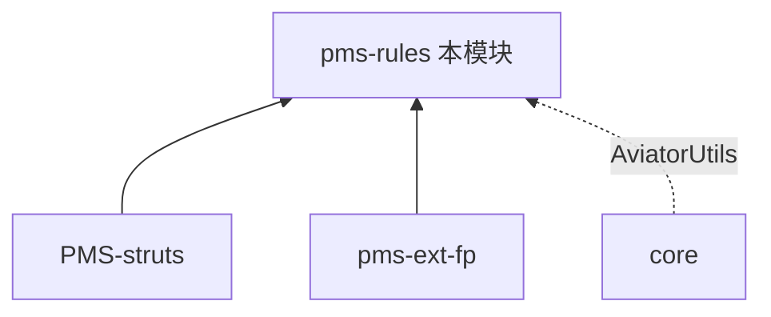

# pms-rules 模块知识库

> DPtech PMS **规则引擎模块**。提供基于 Aviator 的业务规则定义与执行能力，支持动态规则配置。pom.xml 中同时声明了 LiteFlow 和 Groovy 依赖，但均未实际使用（详见 `01-architecture/dependency-analysis.md`）。本知识库独立维护。

---

## 模块定位

| 项 | 值 |
|----|----|
| 目录 | `PMS/pms-rules/` |
| artifactId | `pms-rules` |
| 基础包 | `com.dp.plat.rules` |
| 打包类型 | jar |
| 职责 | 规则定义、规则执行、规则管理 |

### 依赖关系

> PMS-struts 和 pms-ext-fp 依赖 pms-rules 执行业务规则计算。core 的 `AviatorUtils` 提供表达式引擎基础封装。

---

## 文档目录

| 章节 | 内容 |
|------|------|
| [01-architecture](01-architecture/) | 规则引擎架构、技术栈（Aviator/LiteFlow/Groovy） |
| [02-modules](02-modules/) | 规则引擎功能说明 |
| [03-database](03-database/) | 数据库概览 |
| [04-mapping](04-mapping/) | 功能-表 CRUD 矩阵 |
| [05-standards](05-standards/) | 编码规范 |
| [06-reference](06-reference/) | 代码示例 |

---

## 跨库知识共享

- 表达式工具：[core AviatorUtils](../../core/docs/02-modules/common-components.md#8-工具类util19-个)
- 调用方：[PMS-struts](../../PMS-struts/docs/README.md)
- 下游：[pms-ext-fp](../../pms-ext-fp/docs/README.md)
